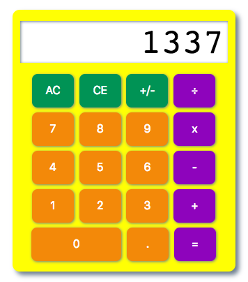

# Calculator

A calculator made using JavaScript, HTML, and CSS. 

Basic operator functionality, positive/negative toggle. Works with mouse and key entry.

Check it out: https://lianagitsit.github.io/calculator/